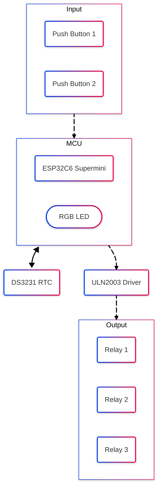

##  ESPHome-BoilerController 
Controller for water boiler and heating system based on ESP32 C6 Supermini and ESPHome.

---

### 🇫 Functions
- Scheduled water boiling control for domestic hot water
- Radiator and Floor heating control

---

### 🆑 Control Logic

Here’s a quick overview of how the relays in the system map to physical hardware and intended modes of operation:

| Relay             | Usecase                                 | ON                                               | OFF                                    |
|-------------------|-----------------------------------------|--------------------------------------------------|----------------------------------------|
| **Relay 1**       | Boiler power                            | Boiler enabled                                   | Boiler disable                         |
| **Relay 2**       | 3‑way valve                             | Water tank flow                                  | Heating systems flow                   |
| **Relay 3**       | Pump for floor                          | Floor heating circulation (requires Heating systems flow)| Radiator‐only heating          |

> **Note:** Relays 4 through 7 are currently reserved for future expansions.

---

### Ⓜ️ Modes and Features

- When **Relay 1** is **ON**, the boiler is powered and heats up water either for the **water tank** or for the **heating system**.
- When **Relay 2** is **ON**, the 3‑way valve directs flow to the **water tank** for domestic hot water production.
- When **Relay 2** is **OFF**, flow is diverted to the **heating systems** (floor &/or radiator) as determined by the other relays.
- When **Relay 3** is **ON**, both floor and radiator heating is active.
- When **Relay 3** is **OFF**, you’ll have radiator heating only (the pump is not actively circulating floor‑heating flow).
- **RTC** timekeeping in case of WiFi or HA malfunction so hot water in the tank is ensured. Note that reboot_timeout is 24h and 48h respectively.
- The “Auto Mode” is for onboard-scheduled **water tank** heating which has the highest priority over other heating modes.
- Virtual Buttons and time‑synchronisation logic ensure that your system honours time‑based and input‑based transitions reliably.
- Push Button actions (short/long press): turn on/off auto-mode/radiator heating/floor heating
- RGB led status representations (RTC error, operation modes)

---

<table>
<tr>
<td width="50%" align="center" valign="top">
  
### 🔧 Hardware Overview

  

</td>

<td width="50%" align="center" valign="top">
  
### 💻 Example [HomeAssistant](https://www.home-assistant.io/) GUI

  

</tr>

</table>

